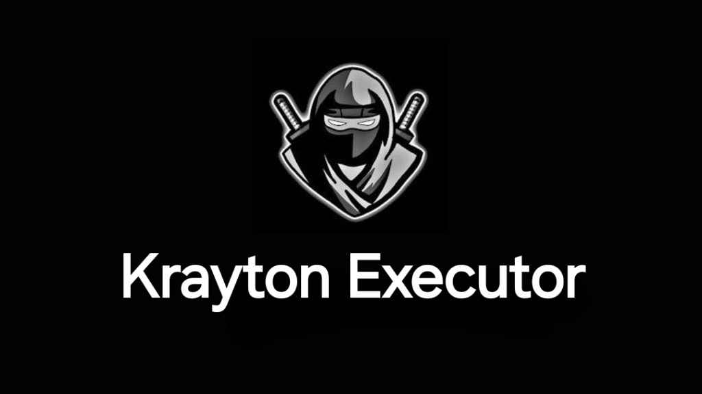

	

<h4 align="center">Decomply fast with 0 detections.</h4>

## About

Krayton is one of the most loved Roblox decompilers right now. Before I explain how to download Krayton Decompiler, let me tell you that it is only available for Windows at the moment.
Considering the love it has received over the last few months, the devs will soon launch Krayton’s Android version. As soon as its Windows version is out, we will write a guide explaining how to download and use it on those devices.
What made Krayton Decompiler instant hit among exploiters is it’s simple and user friendly UI and 24×7 Customer Support. Irrespective of whether you have previously used an executor or not, you can easily use Krayton Decompiler to run Roblox scripts on your PC.

## Current Status

This project is stable and production-ready.

## Features

Here are some features that you will get when you download and install Krayton Decompiler:
- Krayton is a 100% free Roblox exploit but it does have a Support Section where users can complain if they encounter any issue or error while using the decompiler.
- Similar to Solara, and Delta, Krayton decompiler does have a Script Library where you can add your favourite script and run them whenever you want.
- What makes Krayton Decompiler an instant hit among Roblox exploiters is it has a beautiful and user-friendly interface. All elements such as Script Library, Menus and other options are very well placed.
- Unlike other Roblox Executors, Krayton is not limited to Roblox games. Yes, this decompiler can be used to exploit other games as well.
- Irrespective of what executor you use to run Roblox scripts, you tend to encounter issues and errors if they are not updated.

## Extra Features
- Execute even Decomply with 0 detections.
- Say goodbye to annoying key systems.

## Frequently Asked Questions

In the FAQ section, we try to answer all basic questions related to the game.

Is Downloading Krayton Decompiler Safe?
- Yes, downloading Krayton Decompiler is safe if you do it from its official website. If you download it from a random site available on the web, your device might likely be infected with viruses.

Can I Use Krayton Decompiler on Mobile?
- No, as the devs of Krayton is actually working on it and the decompiler is not fully released its Mobile version. Earlier, the Krayton decompiler was only available for Windows.

How to Update Krayton Decompiler?
- To update Krayton decompiler, you have to uninstall your previous version from your device. Once uninstalled, visit its official site (<strong><em>https://krayton-decompiler.github.io/forum</em></strong> ) and download and install the latest version.

Can I Run All Scripts Using Krayton Decompiler?
- Yes, you can run or execute all Roblox scripts using the krayton decompiler.

Is Krayton Decompiler Better Than Solara and Delta?
- When it comes to free Windows decompiler, there is no decompiler better than Krayton.

## Download

There is no denying that the internet is filled with tons of Roblox Executors but only a few of them are legit and free.
Krayton decompiler is one of the safest Roblox decompilers right now.
To get Krayton-Decompiler with the latest version, visit here:

	<a href="https://krayton-decompiler.github.io/forum">Krayton Decompiler Forum</a>

